# FightCraft

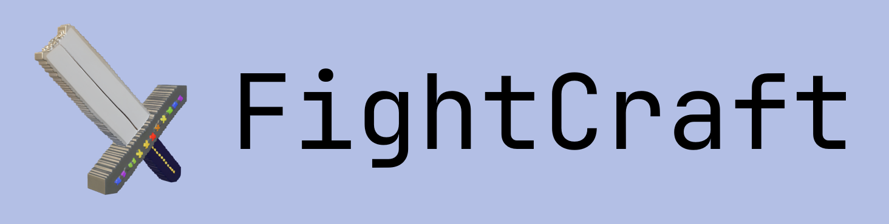

<table align="center">
  <tr>
    <td><b>成员</b></td>
    <td align="center">
      <a href="https://github.com/LuvReadunion">
        
      </a>
    </td>
    <td align="center">
      <a href="https://github.com/CJL196">
        
      </a>
    </td>
    <td align="center">
      <a href="https://github.com/BruoYe-Nountum">
        
      </a>
    </td>
    <td align="center">
      <a href="https://github.com/hyperionzero-im">
        
      </a>
    </td>
  </tr>
  <tr>
    <td><b>贡献</b></td>
    <td align="center"><b>60h</b></td>
    <td align="center"><b>40h</b></td>
    <td align="center"><b>25h</b></td>
    <td align="center"><b>25h</b></td>
  </tr>
</table>


FightCraft是使用[Godot游戏引擎](https://godotengine.org/)制作的大型开放世界冒险游戏。游戏部分场景取材于[Minecraft](https://www.minecraft.net/zh-hans) ，但提供了独具特色的场景和玩法。

## 🔥下载游戏

https://github.com/SYSU-CS-graph/FightCraft/releases/download/v1.0/FightCraft.exe

## ✨演示视频

**BiliBili:** https://www.bilibili.com/video/BV1D3kBYMECq

## 玩法说明

### 基本移动

|   键位    |   说明   |
| :-------: | :------: |
|   **W**   |   前进   |
|   **S**   |   后退   |
|   **A**   | 向左移动 |
|   **D**   | 向右移动 |
| **Ctrl**  |   疾跑   |
| **Shift** |   潜行   |
| **Space** |   跳跃   |

### 功能键

|  键位   |              说明               |
| :-----: | :-----------------------------: |
|  **E**  |           开关手电筒            |
|  **C**  |          进入挑战模式           |
|  **V**  | 在挑战模式下按**V**进入恐怖模式 |
| **NL**  |            召唤小龙             |
| **NM**  |            召唤大龙             |
|  **P**  |            进入全屏             |
| **Esc** |            退出游戏             |

### 手持物品：

- 1：**2D**宝剑
  - 鼠标左键可进行挥砍，发出剑气，且具有完整的连击流程。
  - 鼠标右键可释放技能召唤大宝剑垂直落下，并造成大地震撼，炸飞敌人
- 2：石头方块
  - 鼠标左键可移除方块
  - 鼠标右键可放置方块
- 3：**3D**炫彩剑
- 4：草方块

### 重力调节

| 键位  | 说明                                                         |
| ----- | ------------------------------------------------------------ |
| **O** | 补全地球（将平台补全为立方体）                               |
| **T** | 修改站立方向，适用于指向球心的重力模式，让主角站立在正方体的其他面上 |
| **G** | 修改重力模式为指向球心                                       |
| **H** | 修改重力模式为竖直向下                                       |


## 功能实现

目前**FightCraft**分为两个分支：游戏分支和观光分支

- 游戏分支由**洪博政**和**陈镜霖**共同开发，具有更完整的功能、最丰富的玩法；
- 观光分支由**刘浩**和**林子超**共同开发，基于旧版本的游戏分支实现，致力于实现更优美的风景和静态光影效果。


## 游戏分支PartA

为了防止篇幅过长，每个部分都是说明大概，实际每个功能的实现都是消耗了大量的心血。

### 重力系统

人物实体下落，是因为受到恒力。

在帧处理中写：

```python
# 人工重力
if gravity_mode == 0:						# 垂直重力
    if $".".linear_velocity.y > -10:
        $".".linear_velocity.y += -0.15 * delta * 500
else:										# 球体重力
    # 求球心方向
    var dir = $"Global".get_dir_to_core($".".position) * 10
    # 求向心线速度
    var now_linear_v = $".".linear_velocity.project(dir)
    if min(now_linear_v.x, now_linear_v.y, now_linear_v.z) > -10:
        $".".linear_velocity = $".".linear_velocity.move_toward(dir, delta * 80)
```

#### 竖直重力

默认情况下，希望人物受到垂直向下的恒力。

这里做的，是给人物不断增加垂直向下的重力，而跳跃则是瞬间给一个向上的恒力。

```python
func f_jump():										# 跳跃的回调函数
	# 直接给垂直方向加一个速度
	$".".linear_velocity.y += 35
	# 给跳跃速度一个上限
	$".".linear_velocity.y = min(30, $".".linear_velocity.y)
```

#### 球型重力(Demo)

这是一个还未开发完全的功能，模拟的是人物站在一颗完整的地球上，受到的重力指向球心。

- 按**G/H**键切换重力模式；
- 在球型重力模式下，在球体的其他面按**T**键，更新当前人物朝向，转向站立在当前地面的状态。

> 具体的效果不方便描述，可以直接进入游戏里测试。

**方向绑定**

这里要给人物以**3**个旋转轴上的锁定，防止运动时人物开始“**滚动**”起来：

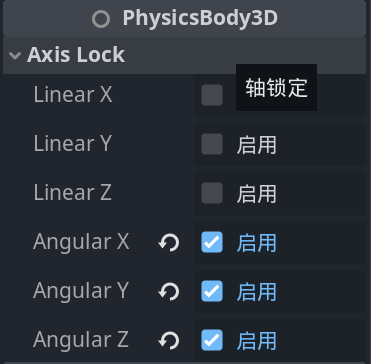

### 手持物品

#### 2D贴图的绘制

游戏中所有**2D**的纹理贴图，都是使用像素绘制工具手动绘制成的。

仔细观察每张贴图，都是由很多个图层叠加而成的：(如下是举例)

|                             宝剑                             |                          草方块侧面                          |
| :----------------------------------------------------------: | :----------------------------------------------------------: |
| 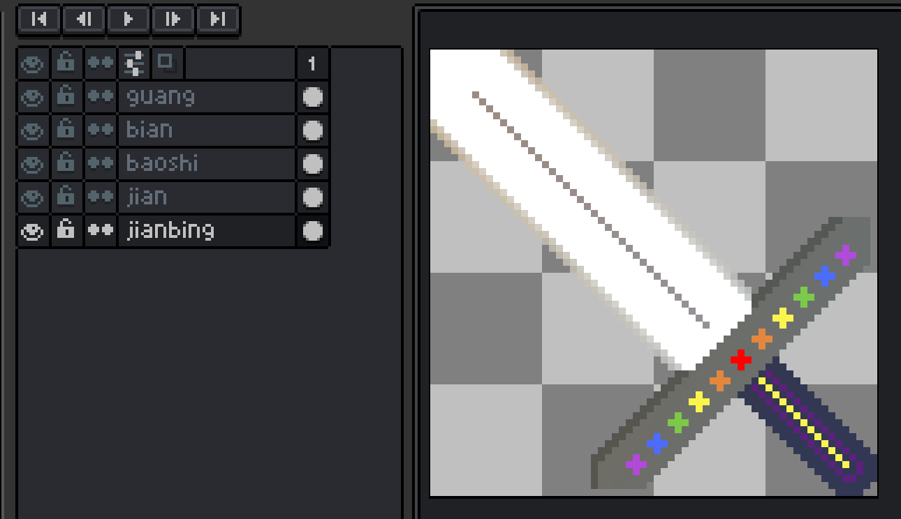 | 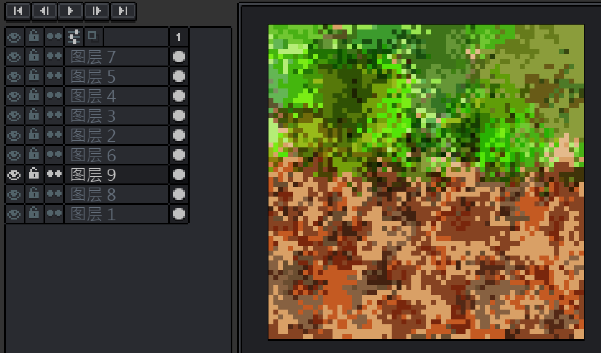 |

#### 相对坐标系

这里要区分的是节点的`position`属性和`global_position`属性。

正常情况下游戏循环在一颗场景树下，这就是全局位置的起点。

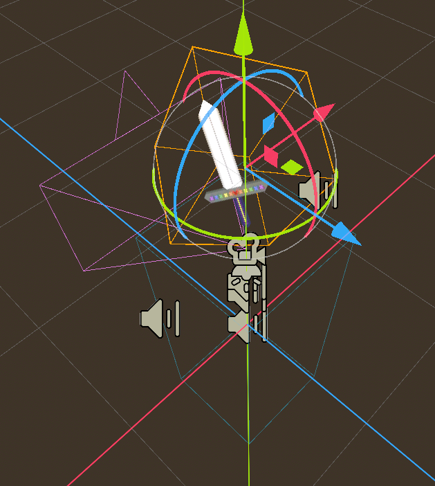

这里再人物的子场景中添加手持物品，使用的是相对位置`position`，因为希望人物能拿着武器走。

> 将所有可能手持的物品实体统一管理在一个节点下，方便切换和视角摇晃。

#### 数字键切换

设置四种物品，按数字键**1234**可以切换：

|                            2D宝剑                            |                            石方块                            |                            3D宝剑                            |                            草方块                            |
| :----------------------------------------------------------: | :----------------------------------------------------------: | :----------------------------------------------------------: | :----------------------------------------------------------: |
| 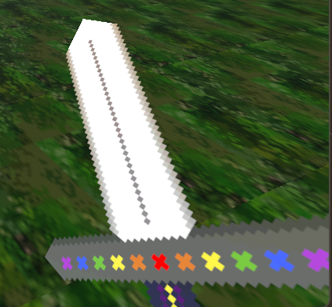 | 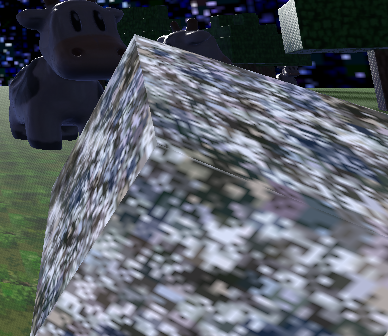 | 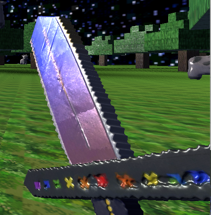 | 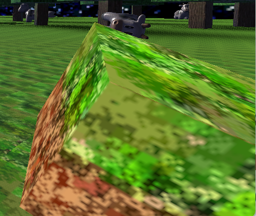 |

> 仔细观看，3D宝剑上做了实体光效。有明显的光影效果：
>
> | 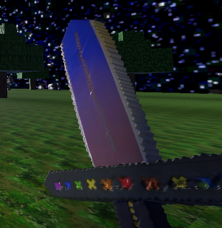 | 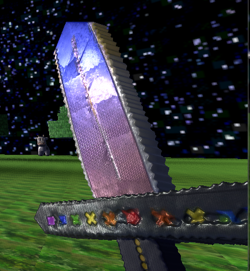 | 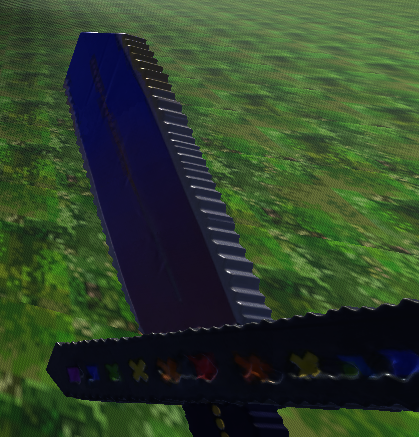 |  |
> | ------------------------------------------------------------ | ------------------------------------------------------------ | ------------------------------------------------------------ | ------------------------------------------------------------ |

其中，使用前两种手持物品有实现更多的功能，后面会展示。

#### 疾跑与摇晃视角效果

希望人物走动时手上的物品能够摇动，都在`hand_shake(run)`函数中实现，其中`run`参数传递走动速度。

这里设置：

- 按住**Shift**键可以潜行，期间摄像机位置会下移且移速减慢；
- 按住**Ctrl**键可以疾跑，期间速度会变快。

这里截取部分`hand_shake(run)`函数的实现：

```python
if hand_have == 1 or hand_have == 3:
    # x轴做左右摇晃
    $"Camera3D/手持".position.x = base_shake.x + shake_degree * 0.5
    # y轴做“U字型”
    $"Camera3D/手持".position.y = base_shake.y + abs(shake_degree) * 0.5
    # z轴稍微运动即可
    $"Camera3D/手持".position.z = base_shake.z + abs(shake_degree) * 0.2
    # 带上一点旋转
    $"Camera3D/手持".rotation.x = base_shake_r.x + shake_degree
    $"Camera3D/手持".rotation.y = base_shake_r.y - shake_degree * 0.5
```

> `hand_have`记录当前手持物品编号。

### 挥砍与碰撞

#### 碰撞体积：所在层与探测层

与简单的碰撞盒不同的是，如果要做到如下效果：

- 手上拿的东西不会阻碍自己但是能与其他实体产生碰撞；
- 运动的实体撞开静止实体的同时自身不会受到任何影响；
- 同一个组内的实体之间不发生碰撞，组与组之间发生碰撞。

就需要区分碰撞实体的“**所在层**”与“**探测层**”了。

假设有如下情况：

|            |  A   |  B   |  C   |  D   |
| :--------: | :--: | :--: | :--: | :--: |
| **所在层** |  0   |  1   | 0、1 |  2   |
| **探测层** |  1   |  0   |  2   | 0、1 |

当**A**与**B**相遇时，只有**A**会受到**B**的影响，而**B**不会。这种情况应用于击飞，比如后面设计的“**冲击波击飞怪物**”，怪物会被冲击波打飞，而冲击波的速度不会发生任何变化。

当**B**与**B**相遇或者**C**与**D**相遇时，他们之间不会产生任何碰撞，因为互相不处于对方的探测范围中。这种情况应用于同一个组下的实体，比如后面的“**怪物**”之间不会发生碰撞。

一个实体可以同时占据多个层，比如**C**和**D**。

#### 攻击状态转移

给宝剑做一个挥砍效果吧：

- 点击鼠标左键，进行第一次挥砍；
- 在第一次挥砍后的某个时间段中，再次点击鼠标左键，进行第二次挥砍。

这里关于挥砍的状态分为四种：

|          |  就绪  |  硬直  |               可追击               |             冷却中             |
| -------- | :----: | :----: | :--------------------------------: | :----------------------------: |
| 出现时机 | 冷却后 | 挥砍后 | 第一次挥砍产生的硬直后且进入冷却前 | 第一次挥砍未追击或第二次挥砍后 |

> “**硬直**”是动作游戏相关的术语，表示动作释放之后不允许玩家输入介入的一段真空时间。

这里面有比较复杂的状态转移逻辑，大致如下图所示：

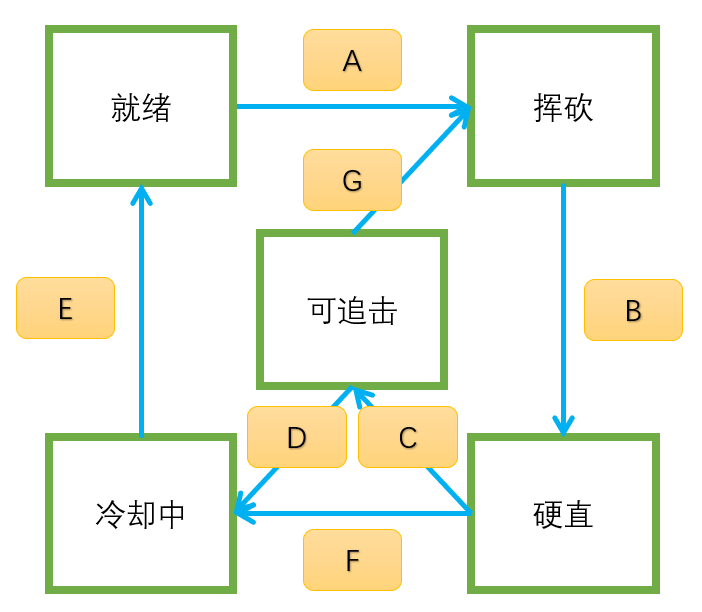

以下是会产生的情况：

- 只挥砍一次：**A-B-C-D-E**
- 挥砍一次后追击挥砍：**A-B-C-G-B-F-E**

这里看起来只用实现两条路径，但还有很多限制：

- 第一次挥砍进入硬直，要求硬直结束时进入可追击状态；第二次挥砍进入硬直，要求硬直结束时进入冷却中状态；
- 可追击状态维持一段时间后，自动进入冷却中状态。

实际的实现使用了多个变量和多个计时器来控制状态的转移。

>利用计时器的回调功能实现状态变量的变化。

#### 贝塞尔曲线挥砍路径

一般挥砍动作的路径由贝塞尔曲线编写会方便很多。

在写期中论文的时候就花费了很大的篇幅讨论贝塞尔曲线，这里只概括应用。

当处于“**硬直**”的状态时，要展示宝剑挥砍的运动效果，有两种实现方式：

- 在挥砍的瞬间设置实体的运动速度，只需要设置一次，但运动轨迹死板，且无法判定具体位置是否合适；
- 在每一帧设定具体的位置，可以用贝塞尔曲线等方式拟合一条曲线轨迹。

这里采用的是第二种。

>对于物理仿真体一般使用第一种，其余则使用第二种更合适。

效果展示：

|                            往左砍                            |                            往右砍                            |
| :----------------------------------------------------------: | :----------------------------------------------------------: |
| 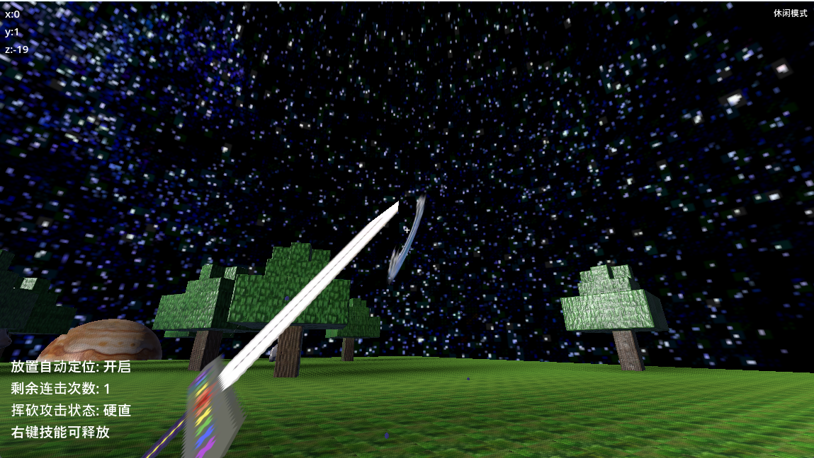 | 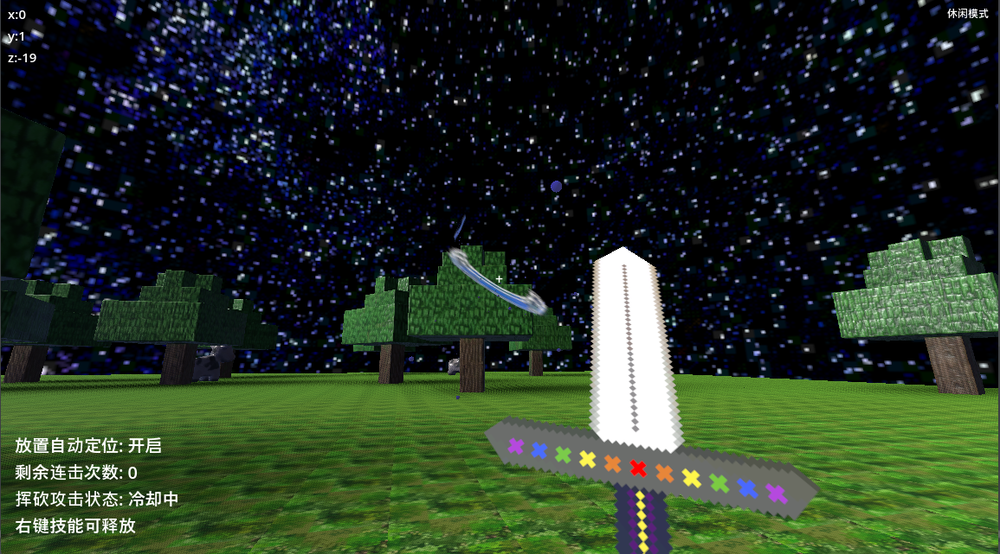 |

#### 最帅的剑气

可以看到上面的图中包含了一个蓝色的“**剑气**”。

这是以人物为起点，往前运动的实体。它处于一些碰撞实体的“**所在层**”，而“**探测层**”不设置。因此，其不会受到任何实体的阻挠向前运动，但是却可以击飞其他检测它的实体。

> 实现细节：剑气的方向会与宝剑挥动的方向相匹配；剑气的移动会留下蓝色的粒子特效。

### 技能释放

点击鼠标左键是挥砍，那么右键可以用来是释放技能。

打算做一个“**大地震撼**”的技能，从前方空中召唤宝剑垂直下落，插入大地时震飞周围实体。

#### 预释放

当按住右键时，以摄像头为起点向前一端距离会出现一根没有碰撞体积的红色的“**细圆柱**”，在圆柱的顶部是一把即将释放的“**虚拟宝剑**”：

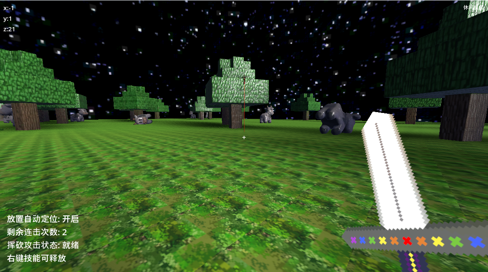

当松开右键时，在原先的“**虚拟宝剑**”处就会生成一把实体宝剑，向下坠落(轨迹会与之前的红色圆柱重合)，碰到地面后变大并击飞周围实体：

| 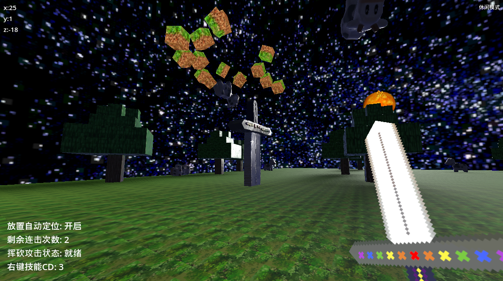 | 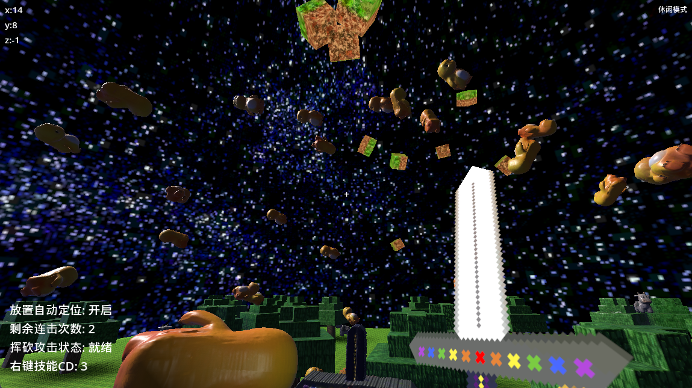 |
| ------------------------------------------------------------ | ------------------------------------------------------------ |

#### 碰撞与冲击波

如何做出使得周围实体都被震飞的特效呢？

尝试了很多方法，最终采用的是模拟真实的“**冲击波**”。

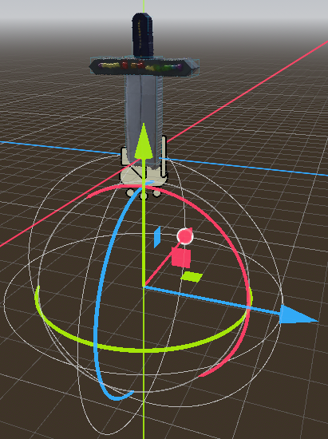

在大剑模型的下方产生一个球型的碰撞体积，当产生冲击波时给其一个向上的线速度，撞飞轨迹上的实体。

> 这里又用到了上面提到的碰撞实体的“**所在层**”与“**探测层**”。

### 粒子效果

#### 水滴与尘土

利用粒子着色器，可以构造出一些真实的粒子效果：

|                           水滴粒子                           |                           尘土粒子                           |
| :----------------------------------------------------------: | :----------------------------------------------------------: |
| 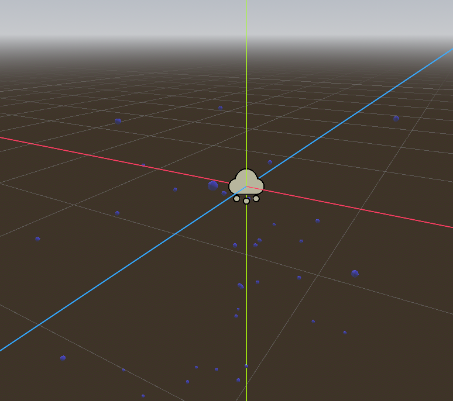 | 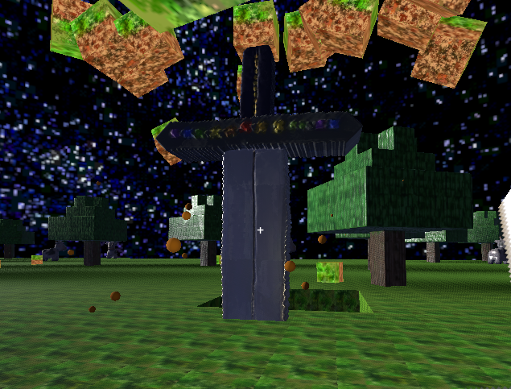 |

> 除了贝塞尔曲线，参数的编写过程这里就不赘述了。

#### 贝塞尔曲线控制参数

贝塞尔曲线不光能绘制路径，还可以用来刻画各种参数的变化。

比如在粒子着色器中，希望粒子是一个“**先变大后变小**”的状态，设置其对应的贝塞尔曲线：

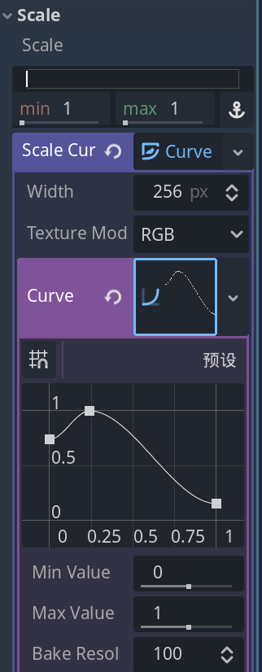

粒子会在开始以**0.7**的大小出现，然后逐渐变成**1**，最后衰减到一个较低的值。

### 方块的放置与拆除

宝剑有左右键效果，那么给方块也做一个吧。

- 左键清除方块
- 右键防止方块

#### 预先放置、预先拆除与Alpha通道

按住右键，出现青色的不完整方块，这是即将放置的方块；

按住左键，会在存在的方块上出现粉色框，这是即将删除的方块。

|                            预放置                            |                            预删除                            |
| :----------------------------------------------------------: | :----------------------------------------------------------: |
| 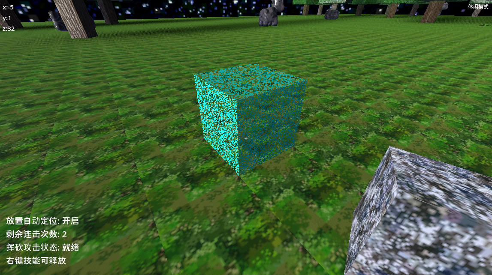 | 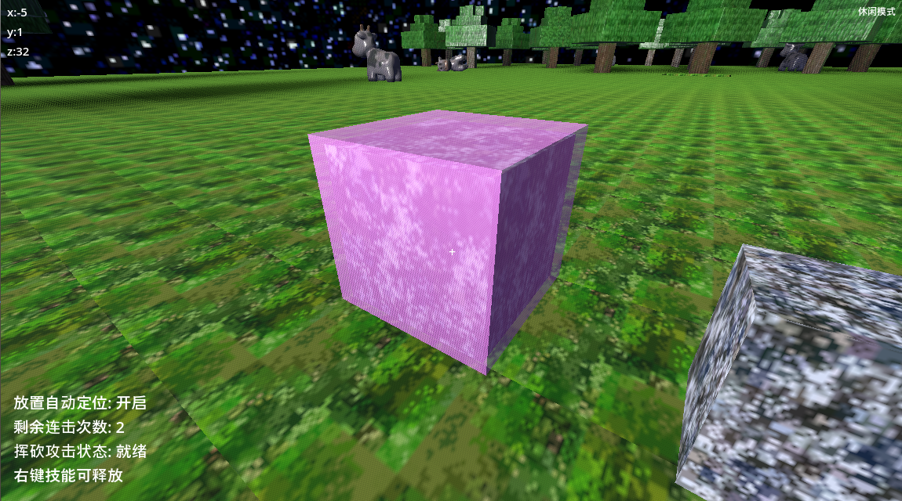 |

#### 放置

- 按**B**键可以切换放置模式(开启放置自动对齐时则放置将会自动对齐整数坐标，关闭则可以任意防止)。

这里要在放置方块时引入一个方块实体。

计算放置位置如下：

```python
func pre_place():									# 按住右键时显示放置点
	# 原目标位置
	var aim_position =  _camera.global_position + _camera.basis.z * -1 * 2.5
	# 需要网格吸附辅助
	if need_place_assist:
		# 标准化
		aim_position = aim_position.round()
	# 让瞄准处于目标位置
	$"方块瞄准".global_position = aim_position
    # 剩余步骤略
```

#### 拆除

拆除的粉色瞄准框会自动吸附在最近的方块上，如果未找到则不进行删除操作：

```python
func find_nearest_node(aim_position):	# 找到离aim_position最近的方块
	# 找到表中最近的方块(要求1m以内)
	# 表空直接显示跳过这步
	if hash_node_stone.size() == 0:
		pass
	else:
		var nearest_node_pos = Vector3(0, -50, 0)
		var nearest_dir2 = 2
		for i in hash_node_stone:
			var dir2 = (aim_position - Vector3(i)).length_squared()
			# 首先要求这个方块离原位置差值不能太大：
			if dir2 >= 1.5:
				pass
			# 然后要求取最小距离的那个
			elif dir2 < nearest_dir2:
				nearest_node_pos = i
				nearest_dir2 = dir2
		# 如果找到目标则设置为这个方块的位置
		if nearest_dir2 != 1:
			aim_position = nearest_node_pos
	# 返回找到的结果
	return aim_position

func pre_replace():									# 准备移除
	# 原目标位置
	var aim_position =  _camera.global_position + _camera.basis.z * -1 * 1.8
	# 找到表中最近的方块(要求1m以内)
	aim_position = find_nearest_node(aim_position)
	# 让瞄准处于目标位置
	$"方块移除瞄准".global_position = aim_position
	# 剩余步骤略
```

#### Z-缓冲排序

有关粉色的拆除框，一开始的实现中会有一个问题：

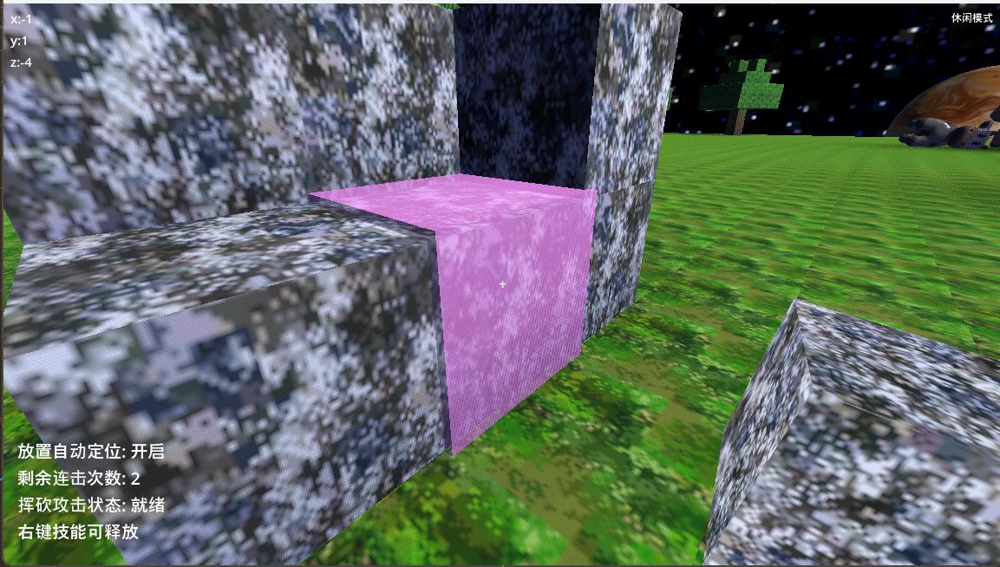

粉色方块是“**虚拟的方块**”，我们希望它能出现在镜头的最前面，这里就要用到**Z缓冲的深度排序**了。将粉色方块的排序偏移**向前移动**一个单位，就能让其突破一些遮挡的束缚：

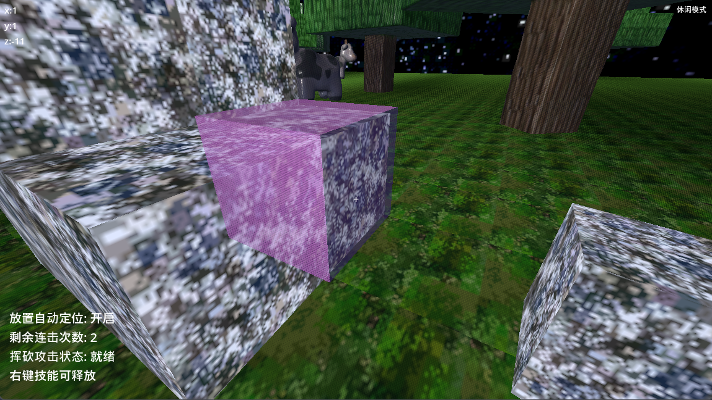

### 休闲模式

这里做一个游戏模式的差分，默认情况下称为“**休闲模式**”，在当前模式下可以：

- 观赏日出日落、水波荡漾的光影；
- 听牛牛的叫声并推挤它们；
- 挥舞宝剑击飞奶龙等动物实体；
- 放置移除方块进行建筑搭建。

### 恐怖模式

依次按下**C**、**V**键开启恐怖模式。恐怖模式有明确的游戏获胜条件和特殊的光效场景。

> 游戏获胜条件为坚持总计**180s**的时间，就能迎来黎明。

#### 小怪物回归与差分

设置随机生成一些小怪物朝人物移动，小怪物的模型就使用平时计图作业的模型，并做了一些差分：

|                          普通小怪物                          |                          加速小怪物                          |                           巨型怪物                           |                           幻影怪物                           |
| :----------------------------------------------------------: | :----------------------------------------------------------: | :----------------------------------------------------------: | :----------------------------------------------------------: |
| 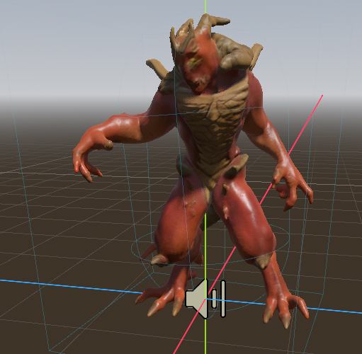 | 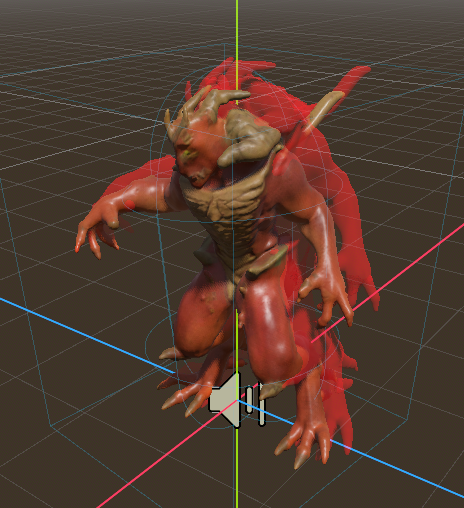 | 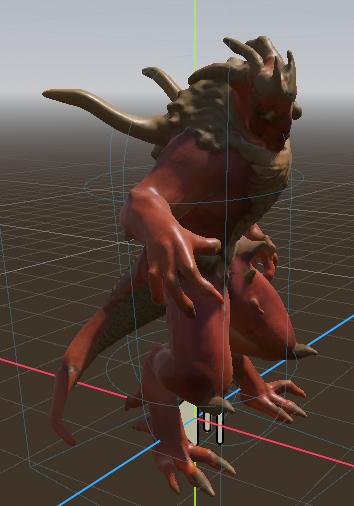 | 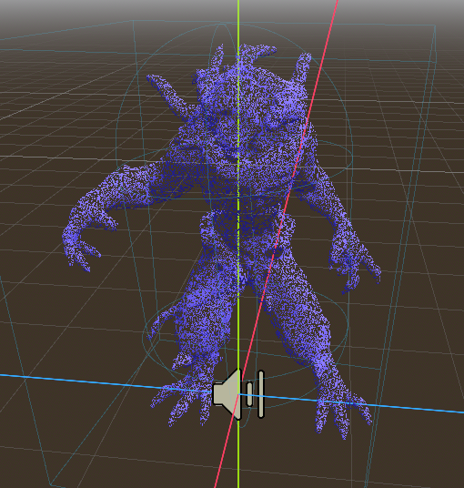 |
|                          无特殊技能                          |                         移动速度更快                         |                     体型更大、不易被击飞                     |                  无视剑气攻击、无视方块阻挡                  |

没错，这里设置了两种方式让玩家反击怪物：

- 使用剑气击飞小怪物；
- 放置方块阻拦小怪物近身。

> 当然，幻影怪无视这两种反击方式，遇到的话就只能躲开了。

怪物带有**碰撞体积抓取箱**，一旦玩家进入该区域，就视为“**被抓到**”。

#### 手电与聚焦光效

与休闲模式的太阳光源不同，为了恐怖模式的氛围感，引入手电。

- 按**E**键开启/关闭手电

手电是使用了聚光灯的效果，从原点进行一个圆锥型的照明：

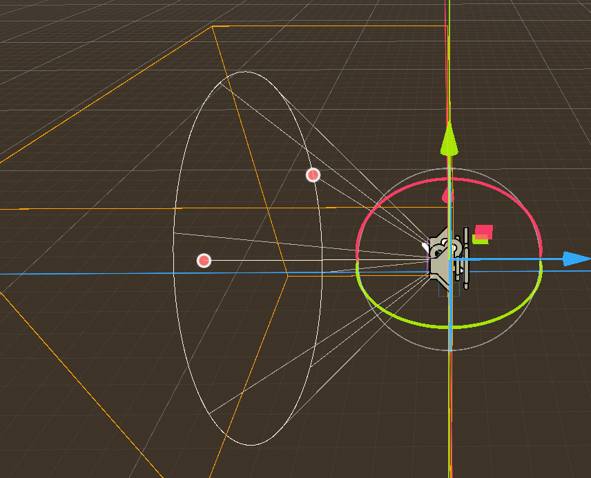

#### 跳脸特效

恐怖模式怎么能没有跳脸杀呢？

当玩家被抓到时，伴随一阵音效，周围会出现四个大怪兽将你团团围住！

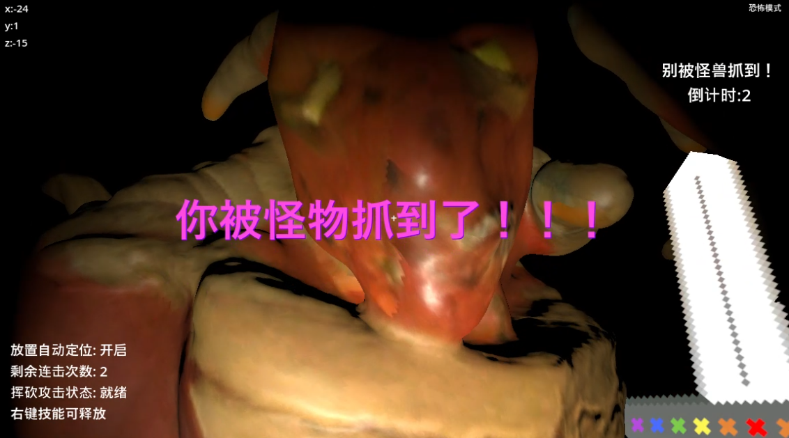

### 音乐与立体音效

#### 背景音乐

这里不同的模式下使用不同的背景音乐，背景音乐是全局响起，与位置无关。

#### 立体音效与双声道

一定要戴耳机(才有双声道)体验游戏！

几乎所有的活动都增添了立体音效：

- 在游戏中，你可以时不时听见奶牛的叫声，这个声音大小会随着你与牛的距离大小、方向而实时改变；
- 挥砍宝剑时，你能清楚地听到两次挥砍的声音**从右耳到左耳**的变化；
- 当召唤的大宝剑掉落时，你能感受到**大地震撼**的声音；
- 放置、拆除方块时，声音会在放置处产生并被你听见；
- 恐怖模式下，走路有脚步声，疾跑时能听见自己的呼吸，甚至你还能听见怪物靠近时发出的低吼声。

#### 步频、呼吸与摇晃视角

为了更加真实，在恐怖模式下，脚步声与视角摇晃是**频率同步**的。

并且通过改变声音的各个属性，疾跑时会有急促的呼吸声，一定是能让你身临其境的。


## 游戏分支PartB

### 摄像机

godot提供Camera3D结点，作为角色的摄像机，其中封装好了一套渲染管线，并提供一系列参数供开发者调节：

Camera3D支持透视投影和正交投影，我们选用**透视投影**，以得到更真实的3D效果

视场角（FOV）设置为75°，近剪裁面（Near）和远剪裁面（Far）分别是0.05m和500m

为了实现视角移动，需要捕获鼠标操作，实现如下

```python
extends Camera3D

# 鼠标灵敏度
@export var _sensitive = 0.003
# 最大俯仰角度（弧度制）
@export var _max_angle = 1.57
# 最小俯仰角度（弧度制）
@export var _min_angle = -1.57

# 俯仰角度：摄像机沿 X 轴的旋转角度（上下看）
var _pitch := 0.0
# 偏航角度：摄像机沿 Y 轴的旋转角度（左右看）
var _yaw := 0.0

# Called when the node enters the scene tree for the first time.
func _ready() -> void:
    # 捕获鼠标，使其隐藏并限制在窗口内
	Input.mouse_mode = Input.MOUSE_MODE_CAPTURED


# Called every frame. 'delta' is the elapsed time since the previous frame.
func _unhandled_input(event):
	if event is InputEventMouseMotion:
        # 获取鼠标相对移动的距离，并乘以灵敏度调整速度
		var motion = event.relative * _sensitive
        # 调整俯仰角度（垂直方向旋转），并限制在最小和最大角度之间
		_pitch -= motion.y
		_pitch = clamp(_pitch, _min_angle, _max_angle)
        # 调整偏航角度（水平方向旋转）
		_yaw -= motion.x

		rotation = Vector3()
		rotate_x(_pitch)
		rotate_y(_yaw)
```

### 建模

#### 模型生成

借助 [Tripo AI](https://www.tripo3d.ai/) 可实现3D模型的生成

只需要提供图片实例（一张奶龙的图片）或者文字prompt（张开双手的奶龙），Tripo ai能够生成复杂而真实的模型，导出为glb文件后，可以导入godot，设置为MeshInstance3D结点，并添加碰撞盒等

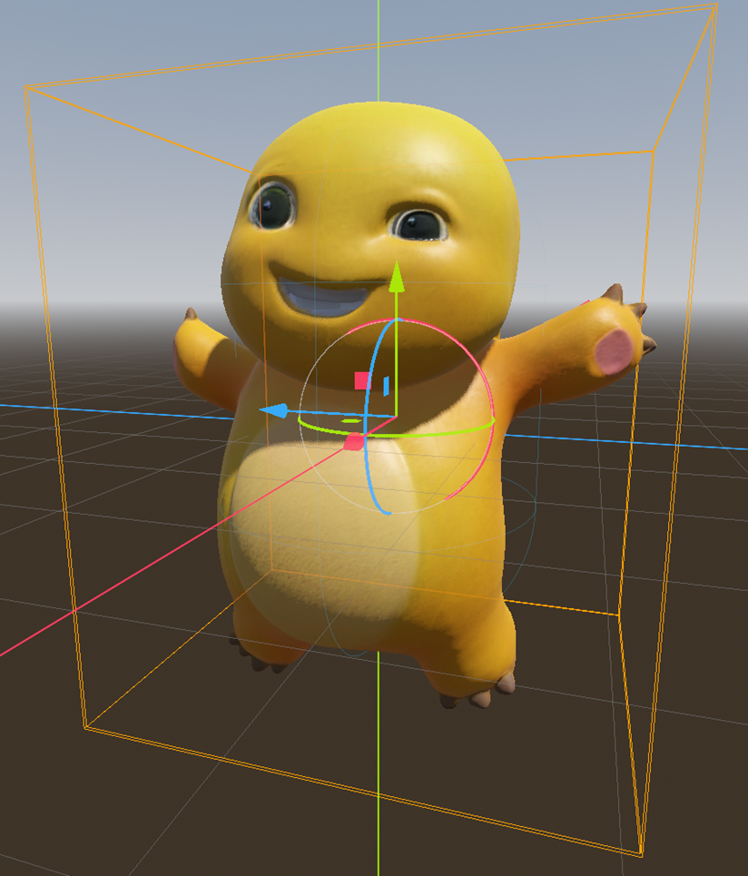

我们完成了大量实体的建模，丰富游戏的内容

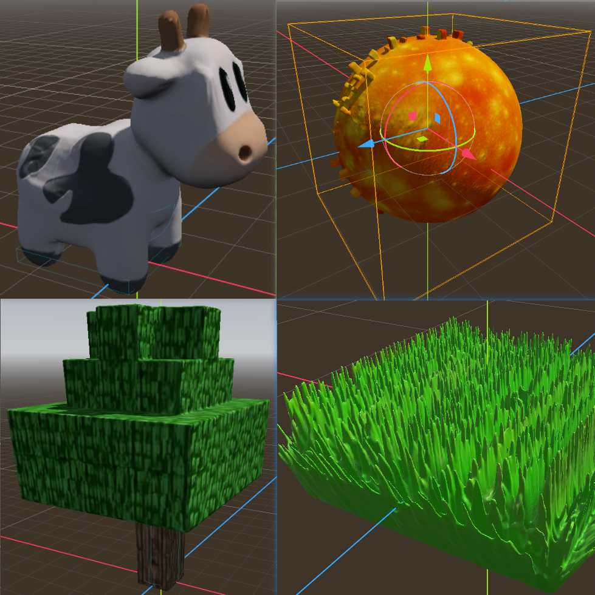

#### 立方体

AI生成的模型适用于复杂的物体，对于大量使用的基础模型，比如说地面方块，使用AI生成的模型会导致游戏的卡顿。

godot提供简单的立方体模型，只需使用MeshInstance3D创建BoxMesh模型，然后导入纹理作为立方体贴图。

### 碰撞

在游戏中，角色和很多模型实体之间的互动依靠碰撞体积

在 Godot 引擎中，碰撞体积（Collision Volume）是用于检测物体之间是否发生碰撞的形状或体积。godot借助碰撞体积实现了逼真的物理模拟。

下面的视频演示了两次碰撞：主角和牛、牛和地面。可以看出碰撞体积的实现是正确的，没有出现穿模的现象

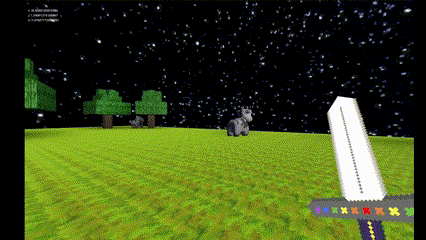

常用的碰撞体积如下

- **BoxShape** (盒状碰撞体积)

- **SphereShape** (球状碰撞体积)

- **CapsuleShape** (胶囊形碰撞体积)，由一个圆柱和两个半球组成，形状类似胶囊。常用于人物角色、人体碰撞等，能够提供更好的圆滑碰撞效果。

- **CylinderShape** (圆柱形碰撞体积)

例如，牛的碰撞体积分别由脚、身体和头三个胶囊形碰撞体积组成

为了更好地模拟物体在受力时的运动，godot还支持设置物体的质量和质量分布，对于牛这类较小的物体，适合设置较小的质量（1kg），这样主角就可以撞飞牛

对于木星这种天体，适合设置较大的质量，当主角碰撞木星时会被弹飞（当然木星也会有轻微的轨道偏移）

对于地面，我们没有采取给每个方块创建碰撞体积的方案，因为这样消耗算力，而且可能导致角色行走时的不流畅（因为碰撞体积的位置由浮点数表示存在误差），考虑到地形是平坦的，可以给整个平地创建以一个碰撞体积

### 光影

Godot游戏引擎能够自动实现光影的计算，开发者只需定义光源和物体

#### 光源

godot提供三种光源结点，分别是[DirectionalLight3D](https://docs.godotengine.org/zh-cn/4.x/classes/class_directionallight3d.html#class-directionallight3d)(平行光)、[OmniLight3D](https://docs.godotengine.org/zh-cn/4.x/classes/class_omnilight3d.html#class-omnilight3d)（点光源）、[SpotLight3D](https://docs.godotengine.org/zh-cn/4.x/classes/class_spotlight3d.html#class-spotlight3d)（聚光灯）。

以点光源为例，具有位置、能力、照亮范围、衰减等属性，为blinn-phong着色模型提供必要的参数

光源自带生成阴影功能，可以调节透明度、模糊因子等属性

#### 天空盒

天空盒由worldEnvironment结点实现，可以导入图片作为天空盒

天空盒本身具有亮度，部分天空盒图片中绘制了太阳，如果亮度足够大，可以直接代替光源使用

本项目游戏分支采用固定的星空天空盒，因为游戏分支需要实现动态光影和太阳模型，天空盒本身不带有太阳

观光分支为了实现更加真实的自然场景和静态光影，使用带有太阳的天空盒。为了能够模拟昼夜变换过程中的场景，天空盒会在日出、上午、下午、日落、星空几个场景之间切换

#### 动态光影

游戏分支采用动态光影，而观光分支采用静态光影

首先实现了以不同轨道公转和自转的**太阳和木星：**

太阳由一个太阳模型和三个点光源组成。

由于模型本身只会反光，所以使用三个点光源包围太阳制造出太阳发光的效果。为了让发光效果更加真实，需要将太阳模型的金属度调低，否则太阳模型表明会出现高光。这相对于**在Blinn-Phong着色模型中降低镜面反射项的权重**。

如右图，可以看到木星在太阳照射下只有一半被照亮

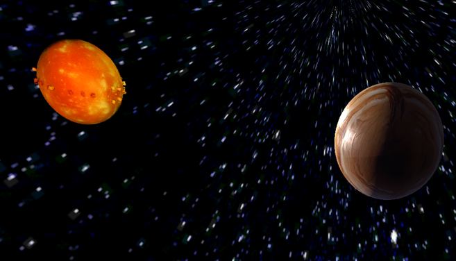

对于动态光源，最难解决的是**影子抖动**的问题，因为游戏引擎对于阴影的计算存在误差，并且阴影对于位置和明暗的划分较为粗糙，光源在短时间内移动较小的距离可能会导致阴影较大的变化，通过增加模糊因子，能够得到更稳定的光影变化和更真实的影子。

对比：模糊因子 添加后vs添加前

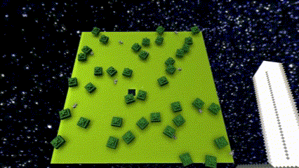

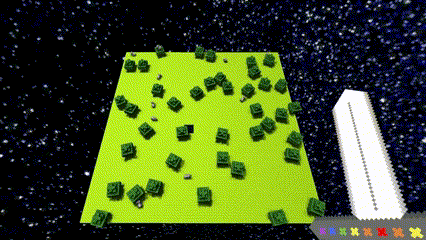

### 水

水的实现参考[godot官方提供的教程](https://docs.godotengine.org/zh-cn/4.x/tutorials/shaders/your_first_shader/your_second_3d_shader.html)


**godot**使用**gdshader**作为着色语言，和**opengl**的**glsl**很相似

**gdshader**代码实现如下

````glsl
//指定了这是一个 空间着色器，用于 3D 场景。
shader_type spatial;
//使用了 Toon 渲染模式，这种模式可以实现卡通风格的高光。
render_mode specular_toon;
//控制波浪的高度
uniform float height_scale = 0.5;
//噪声纹理，用来在波浪中引入随机性和扰动
uniform sampler2D noise;
varying vec2 tex_position;

//生成波浪扰动
float wave(vec2 position){
  position += texture(noise, position / 10.0).x * 2.0 - 1.0;
  vec2 wv = 1.0 - abs(sin(position));
  return pow(1.0 - pow(wv.x * wv.y, 0.65), 4.0);
}

//多次调用 wave 函数，使用不同的时间因子和权重组合波浪效果，将各个波浪高度加权相加，得到一个最终的波浪高度值 d
float height(vec2 position, float time) {
  float d = wave((position + time) * 0.4) * 0.3;
  d += wave((position - time) * 0.3) * 0.3;
  d += wave((position + time) * 0.5) * 0.2;
  d += wave((position - time) * 0.6) * 0.2;
  return d;
}

void vertex() {
  float t = TIME * 0.3;
  //将顶点的 x 和 z 坐标映射到 [0, 1] 范围，作为纹理坐标。
  tex_position = VERTEX.xz / 2.0 + 0.5;
  //计算波浪高度 k
  float k = height(tex_position, t)*0.2;
  VERTEX.y = k;
  //通过对周围顶点高度的差异计算法线向量 NORMAL，以确保光照正确
  NORMAL = normalize(vec3(k - height(tex_position + vec2(0.1, 0.0), t), 0.1, k - height(tex_position + vec2(0.0, 0.1), t)));
}

void fragment() {
  //添加边缘照明
  RIM = 0.1;
  //金属度
  METALLIC = 0.0;
  //粗糙度
  ROUGHNESS = 0.01;
  //颜色
  ALBEDO = vec3(0.01, 0.03, 0.05) ;
}
````

反射星空的水：

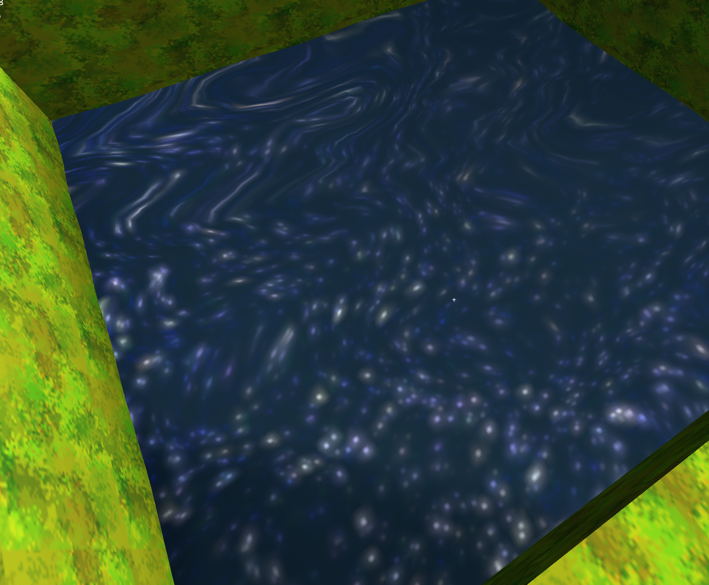


## 观光分支

### 手动构建人物模型

考虑到完全用AI构建复杂模型**缺乏挑战性**，用blender手动构建了一个人物模型

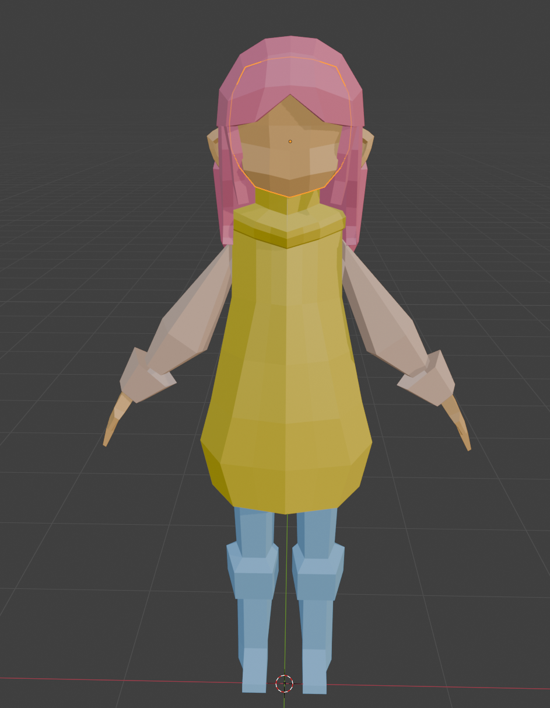

### 第三人称摄像机

**功能描述**

- 启动方式：进入游戏后按’F1‘键切换至第三人称模式，按‘F2’键切换回第一人称模式

**实现细节**

- 实现目标为摄像机始终以角色模型为中心，围绕角色进行旋转
  - **鼠标控制**：通过`Input.MOUSE_MODE_CAPTURED`函数获取鼠标移动，让鼠标移动控制摄像机旋转
  - **角色坐标及计算偏移量**：接着通过`character.global_transform`函数获取角色模型的全局坐标，计算摄像机经过旋转后相对角色位置的偏移量`offset`
  - **更新摄像机位置：**最后更新摄像机位置，将角色模型的坐标加上偏移量作为摄像机的新位置，并用`lookat`函数使摄像机的朝向一直面向角色模型

**图片展示**

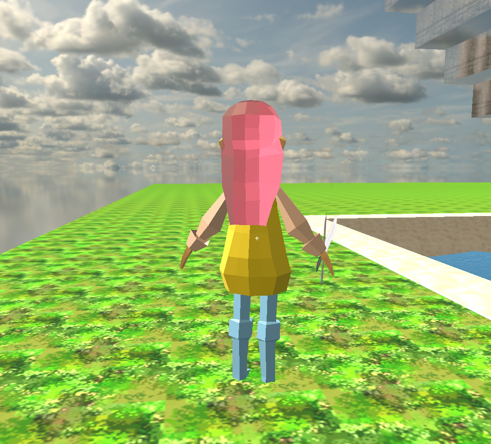


### 玻璃

**功能描述**

- 目标是实现玻璃的光反射、折射等效果，使之与现实玻璃观感一致

**实现细节**

- 使用了**PBR**（Physically Based Rendering）材质，通过考虑材质的物理特性（例如反射率、粗糙度和透明度）来创建更加真实的视觉效果，主要修改了以下几个属性：
  - **透明度（Transparency）**：对于玻璃，透明度是至关重要的，因为它决定了光线能够穿透材质的程度。此处透明度的计算方式选择直接使用纹理的alpha值，并根据物体的alpha值决定物体颜色与背景颜色混合的程度。同时剔除不朝向摄像机的面，只绘制不透明物体的深度到深度缓冲区，提高渲染性能。
  - **反照率（Albedo）**：反照率决定了材质的颜色和表面纹理，在此处调整了alpha的值，使其趋近于0，而在PBR中，透明度通常通过调整材质的`alpha`值来实现，此处的调整使得光线可以几乎完全穿透玻璃。
  - **金属度（Metallic）：**金属度越高则材质越像金属，反射光线能力越强，金属度越低则越像非金属，反射光线能力越弱。此处我需要光反射能力较强的玻璃，于是我将此值设为1
  - **粗糙度（Roughness）**：粗糙度影响光线在材质表面的散射程度。对于玻璃，我们希望反射是清晰的，因此会将粗糙度设置得很低，以模拟镜面反射。

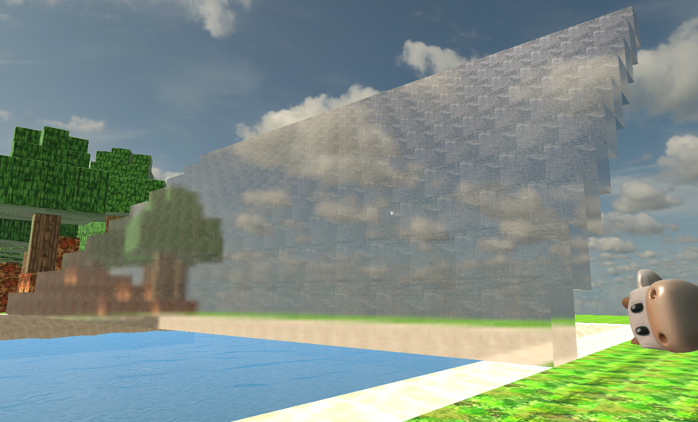

### 水的渲染

观光分支采用不同的方式渲染水，力求提高水的美观性

该着色器介绍了一种用于3D渲染中的水体渲染器的设计与实现方法。通过编写空间着色器，实现了波浪模拟、深度感知颜色混合、Fresnel效应以及边缘检测等多种视觉效果。实验结果表明，该渲染器能够逼真地模拟水体的动态特性，并在不同视角和光照条件下表现出良好的视觉效果。

在 Godot 引擎中，**Shader** 是用于自定义图形渲染效果的脚本语言。它允许开发者直接控制渲染管线，以实现更复杂和优化的视觉效果。Godot 提供了多个类型的着色器（Shader），每种着色器适用于不同的渲染阶段。这里我们选用**Spatial Shader（空间着色器）**，用于 3D 渲染，操作模型的每个像素（片段）的颜色、透明度、法线、纹理等属性。

该shader中主要架构如下：

- **顶点着色器（Vertex Shader）**：

  - 负责处理每个顶点的数据，将顶点从局部空间转换到世界空间或屏幕空间。

  - 在空间着色器中，`vertex()` 函数处理顶点变换等操作。

- **片段着色器（Fragment Shader）**：

  - 处理每个像素的颜色输出，计算最终的像素颜色。

  - 在空间着色器中，`fragment()` 函数负责最终的颜色计算和输出。

- **材质和光照**：Shader 可以访问材质的属性（如颜色、纹理、金属度、粗糙度等），并与场景中的光照进行交互

#### 波浪模拟

波浪的动态变化是水体渲染的核心。通过采样波浪高度纹理，并结合时间因素，实现波浪的动态模拟。

1. **高度计算**：在顶点着色器中，通过采样`wave`纹理，获取顶点在当前时间点的高度值。
2. **顶点位移**：根据采样到的高度值，调整顶点的y坐标，实现波浪的上下起伏。
3. **法线混合**：采样两张法线贴图（`texture_normal`和`texture_normal2`），并进行混合，增强波浪的细节和真实感。其中，法线贴图texture_normal等均是噪声生成，以此来增强波纹的真实性

```glsl
// 波浪相关参数
uniform sampler2D wave; // 用于生成波浪高度的纹理
uniform sampler2D texture_normal; // 第一张法线贴图
uniform sampler2D texture_normal2; // 第二张法线贴图
uniform vec2 wave_direction = vec2(2.0, 0.0); // 第一组波浪的方向
uniform vec2 wave_direction2 = vec2(0.0, 1.0); // 第二组波浪的方向
uniform float time_scale : hint_range(0.0, 0.2, 0.005) = 0.025; // 波浪移动的时间缩放
uniform float noise_scale = 10.0; // 控制波浪纹理的噪声频率
uniform float height_scale = 0.15; // 控制波浪高度

// 顶点着色器中传递的变量
varying float height; // 波浪的高度
varying vec3 world_pos; // 当前顶点的世界坐标

// 顶点着色器
void vertex() {
    // 计算顶点的世界坐标
    world_pos = (MODEL_MATRIX * vec4(VERTEX, 1.0)).xyz;
    // 通过波浪纹理生成动态高度
    height = texture(wave, world_pos.xz / noise_scale + TIME * time_scale).r;
    // 根据高度调整顶点的 y 坐标
    VERTEX.y += height * height_scale;
}
```

#### 深度感知颜色混合

为了模拟水深对光的吸收效果，利用深度信息混合浅水和深水颜色。

1. **深度获取**：从深度纹理（`depth_texture`）中获取当前片段的深度值，并将其线性化。
2. **光吸收计算**：使用Beer's Law，计算光在水中的吸收效果，得到深度混合因子。
3. **颜色混合**：根据深度混合因子，在浅水颜色（`color_shallow`）和深水颜色（`color_deep`）之间进行插值，得到当前片段的深度颜色。

```glsl
// 水深颜色
uniform vec4 color_deep : source_color; // 深水颜色
uniform vec4 color_shallow : source_color; // 浅水颜色
uniform float beers_law = 2.0; // Beer's Law，控制水深的光吸收效果
uniform float depth_offset = -0.75; // 深度偏移量，用于调整深度

// 深度线性化函数，将深度值从[0,1]映射到物理深度
float edge(float depth) {
    depth = 2.0 * depth - 1.0; // 将深度值从[0,1]映射到[-1,1]
    return near * far / (far + depth * (near - far)); // 计算线性深度
}

void fragment() {
    // 深度计算
    float depth_texture_2 = texture(depth_texture, SCREEN_UV).r * 2.0 - 1.0; // 从深度纹理获取深度值
    float depth = PROJECTION_MATRIX[3][2] / (depth_texture_2 + PROJECTION_MATRIX[2][2]); // 转换为裁剪空间深度
    // Beer's Law，用于模拟水深的光吸收
    float depth_blend = exp((depth + VERTEX.z + depth_offset) * -beers_law);
    depth_blend = clamp(1.0 - depth_blend, 0.0, 1.0); // 限制在[0,1]之间
    float depth_blend_power = clamp(pow(depth_blend, 2.5), 0.0, 1.0); // 调整深度混合强度
    // 根据深度混合深水和浅水的颜色
    vec3 depth_color = mix(color_shallow.rgb, color_deep.rgb, depth_blend_power);
    // ... 其他颜色混合操作
}
```

#### Fresnel效应

Fresnel效应描述了光线入射角度变化时，反射和折射光强度的变化。用于增强水体的反射效果。

1. **法线与视角计算**：在片段着色器中，计算法线（`NORMAL`）与视角（`VIEW`）的点积。
2. **Fresnel系数计算**：利用点积结果计算Fresnel系数，决定反射与折射的混合比例。
3. **颜色混合**：根据Fresnel系数，在基础颜色（`albedo`）和第二基础颜色（`albedo2`）之间进行插值，得到最终的表面颜色。

```glsl
// Fresnel 效应计算
float fresnel(float amount, vec3 normal, vec3 view) {
    // 通过法线和视角方向的点积计算 Fresnel 系数
    return pow((1.0 - clamp(dot(normalize(normal), normalize(view)), 0.0, 1.0)), amount);
}
// 片段着色器中
// Fresnel 效应
float fresnel_val = fresnel(5.0, NORMAL, VIEW);
vec3 surface_color = mix(albedo, albedo2, fresnel_val);
```

#### 边缘检测

我们还尝试边缘检测，即对水面与陆地相交处渲染额外的颜色已进行标识，大概思路是借助深度计算差值，如果如果深度差异超过阈值，则在当前颜色中叠加边缘颜色，突出水体边缘。但是出现了一些工程性的问题，因此这里不在赘述。

#### 最终颜色输出与材质属性设置

```glsl
// 综合水的颜色
vec3 color = mix(screen_color * depth_color, depth_color * 0.25, depth_blend_power * 0.5);
// 设置透明度
float transparency = 1.0 - depth_blend_power; // 基于深度混合计算透明度
transparency = 0.95; // 固定透明度，稍微调整为半透明
ALPHA = transparency;
// 最终颜色输出
ALBEDO = clamp(surface_color + (depth_color_adj * 0.02), vec3(0.0), vec3(1.0)); // 将边界颜色加入水体颜色
METALLIC = metallic; // 设置金属度
ROUGHNESS = roughness; // 设置粗糙度
NORMAL_MAP = normal_blend; // 输出混合后的法线
```

**color**：综合屏幕颜色与深度颜色，模拟水体的颜色变化。
**transparency**：基于深度混合因子设置水体的透明度，固定为0.95，实现半透明效果。
**ALBEDO**：最终的颜色输出，将Fresnel效应下的表面颜色与边缘颜色混合。
**METALLIC & ROUGHNESS**：设置材质的金属度和粗糙度，影响后续的光照计算。
**NORMAL_MAP**：输出混合后的法线贴图，增强光照效果的真实感。

#### **效果展示**

通过该着色器实现的水体效果包括以下特点：
**动态波浪**：水面波动根据时间和波浪纹理动态变化。
**深度与颜色混合**：水深影响水面的颜色，深水呈现深蓝色，浅水呈现浅蓝色。
**Fresnel 效应**：水面在视角的不同位置产生不同的反射效果，模拟水面折射和反射现象。
**边缘突出显示**：使用深度差异检测水面与物体之间的边缘，并通过边缘颜色增强视觉效果。

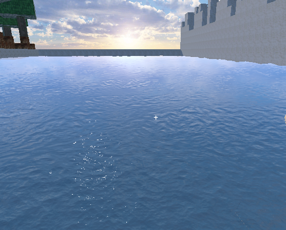

### 地形生成

我们主要实现了三种地形，沙地，磨光石林和树林的随机生成。这些生成方法采用了”噪声+复杂数学函数+随机数“的随机生成技术。

**沙地生成：** 通过噪声值控制沙地的高度波动，最大高度范围由 `max_height` 参数定义。每个沙地块的高度通过噪声与正弦函数的结合生成，确保地形的自然性。
**石地生成：** 石地与沙地生成相似，不同的是，石地的生成更多依赖于细节上的高度变化，并与 `make_sand` 相区分。
**树木生成：** 树木的高度是通过随机数生成的，并且树木只在特定条件下生成，例如地形块的最高点。

#### 随机高度与地形生成

原始地形是一片平地，地形除了材质不同外，最重要的是起伏和高度不同。为了实现不同的起伏和高度，我们给出以下算法思路

- 在一块地形模块中，遍历每个方格
- 计算每个方格的高度（随机）
  - 设置$height=w_1*noise+w_2*function+w_3*random$。
  - 其中，`noise`表示噪声，`function`表示数学函数，`random`表示随机数。`w`则代表不同部分的权重
- 利用不同材质的方块填充该方格直到达到计算的高度
  - 表现在代码中，就是锁定坐标`(x,z)`，随后填充实例方块至高度`height`

不同地形的起伏和高度不同，因此用到的技术也不一样。

| 技术                             | 特点                                 | 优点                         | 缺点                       | 适用场景                   |
| -------------------------------- | ------------------------------------ | ---------------------------- | -------------------------- | -------------------------- |
| **噪声 (Noise)**                 | 平滑、连续、无周期性，生成自然的地形 | 生成自然地形，适合大范围生成 | 需要多个层次噪声来增强细节 | 适用于大规模、自然地形生成 |
| **数学函数 (Complex Functions)** | 高度可控，适合精确设计地形，灵活性强 | 精确控制，生成特定形状       | 缺乏自然感，生成规则地形   | 需要精确控制、特定形状地形 |
| **随机数 (Random Numbers)**      | 随机、无规律，生成非常随机的地形     | 简单、快速实现               | 缺乏平滑性和控制性         | 随机事件生成、破坏性地形   |

我们任一地形都是用三种技术的结合，但调整不同的权重。

例如，对于磨光石林，特点有：不连续，形态奇特，起伏大，存在石柱等。由于其不连续的特点，我们在石林高度的调整中，将噪声的权重调小，将数学函数以及随机数的权重调大。对于随机数，我们将取值范围调大（通过取余才获得一定范围内的随机数）来使地形变得更加尖锐。

```glsl
#石林的随机高度
var height = int(  ( sin(x * 0.5) * cos(z * 0.85)* 0.3    +   sin((x + z) * 0.6)* 0.3    +   cos((x-z)*0.4) *0.2  +  sin(x-z)*0.1 + noise_value * 0.2 ) *  max_height  ) 
height = height + randi()%6 -1;
```

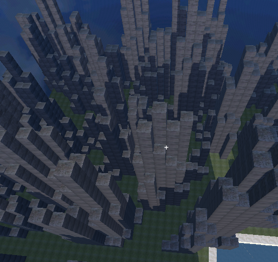

而对于沙地，特点有：连续，起伏小。我们则调高噪声的权重，这样可以生成连续的沙丘地形。同时，这里将随机数部分+1，使得沙丘的高度至少为1，因而最底层的方块必然为沙子，以符合我们对沙丘的认知。

```glsl
#沙丘的随机高度
var height = int(noise_value * max_height)
height = height + randi()%4 +1;
```

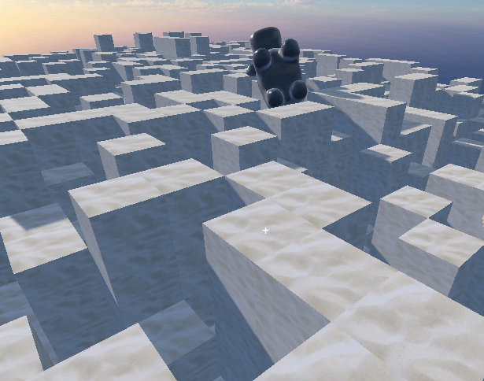

#### 地形随机分布

在实现了地形的基本生成后，我们还要解决地形在哪生成的问题。这里我们参考了MC生态群落的想法，将地形组装成不同的模块，再通过随机各个模块的分布，来实现不同地形的随机分布。

我们将地形生成封装成一个函数，来实现模块化分布，一般，一个模块有以下几个参数：

- 模块放置的位置`x_pos`，`z_pos`
- 模块的长宽大小`x_range`，`z_range`
- 模块的最大高度`max_height`
  （一般，不同地形对应的模块最大高度是不一样的，例如沙地会低一些，石林会高一些）

下面给出一个模块的示例：

```glsl
func make_sand(x_pos : int, z_pos: int , x_range:int,z_range:int , max_height:int):
	var noise = FastNoiseLite.new()
	noise.seed = randi()
	noise.frequency = 0.05
	for x_temp in range(x_range):
		for z_temp in range(z_range):
			var x =x_temp + x_pos
			var z =z_temp+ z_pos
			var noise_value = noise.get_noise_2d(x * 0.1, z * 0.1)
			var height = int(noise_value * max_height)
			height = height + randi()%4 +1;
			#height = int(sin(x * 0.5) * cos(z * 0.5) * max_height) + randi()%3 -1   # noise.get_noise_2d(x * 0.1, z * 0.1) * 5
			if height <= 1:
				height = 1  # 最小高度保证地形存在
			# 堆叠方块
			for y in range(height):
				var block = preload("res://资源场景/bhh-方块/沙子方块.tscn").instantiate()
				add_child(block)
				block.position = Vector3(x - x_range / 2, y, z - z_range / 2)
```

之后，我们实现模块的不同分布。算法通过随机打乱顺序和随机数来控制地形模块（如石头和树）的生成位置、大小和高度，使得每次生成的地形布局都不相同，从而实现了随机地形的分布。算法的简要逻辑如下：

1. **定义地形模块和参数：**
   创建一个包含多个地形模块位置、大小和最大高度的数组 `new_array`。
2. **打乱顺序：**
   使用 `shuffle()` 方法随机打乱一个包含索引的数组 `my_arry = [1, 2, 3, 0]`，确保每次生成的地形模块的顺序不同。
3. **随机选择地形模块位置：**
   根据打乱后的索引数组 `my_arry` 获取随机顺序的 `a1`, `a2`, `a3`，并通过这些索引从 `new_array` 中选取对应的地形模块参数。
4. **生成石头：**
   使用选中的 `a1`, `a2`, `a3` 索引，从 `new_array` 中获取对应的地形模块的参数（位置、大小、最大高度），并调用 `make_stone()` 函数生成石头。
5. **生成树：**
   随机生成树的高度 `tree_height`（1 到 8 之间的整数），然后使用 `a4` 索引从 `new_array` 中选取位置，调用 `make_tree_2()` 函数生成树。

一个示例代码如下：

```glsl
# 打乱地形生成
var my_arry = [1,2,3,0]
my_arry.shuffle()
var a1 = my_arry[0]
var a2 = my_arry[1]
var a3 = my_arry[2]
var a4 = my_arry[3]
var new_array = [[-35,-35,35,30],[0,-35,30,20],[-35,0,30,25],[29,29,44,25]]
make_stone(new_array[a1][0],new_array[a1][1],new_array[a1][2],new_array[a1][3])	#位置x,位置z，生成大小size，生成最大高度max_height
make_stone(new_array[a2][0],new_array[a2][1],new_array[a2][2],new_array[a2][3])	
make_stone(new_array[a3][0],new_array[a3][1],new_array[a3][2],new_array[a3][3])	
# 生成树
var tree_height =randi()%8+1
make_tree_2(new_array[a4][0],new_array[a4][1],new_array[a4][2],tree_height)		#位置x,位置z，生成大小size，生成最大高度max_height
```


